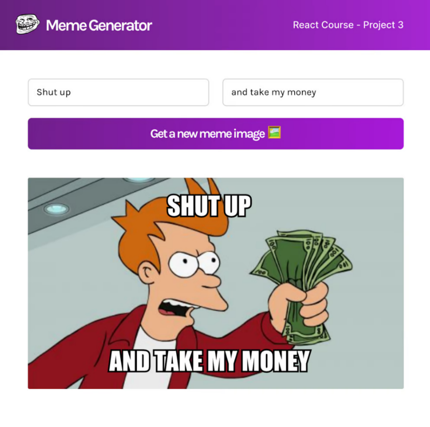
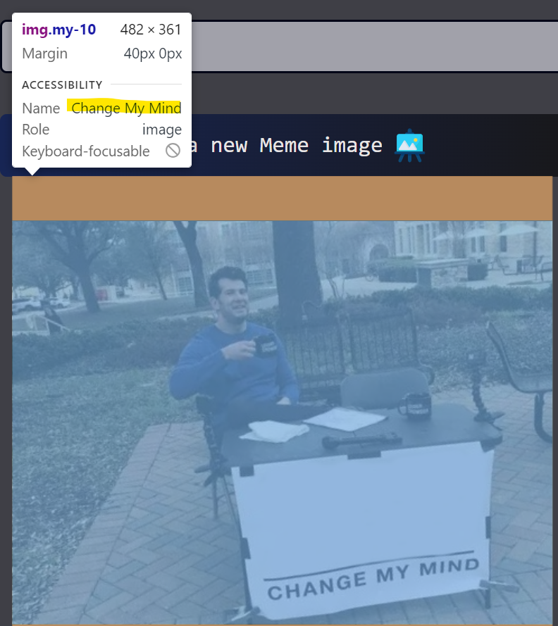
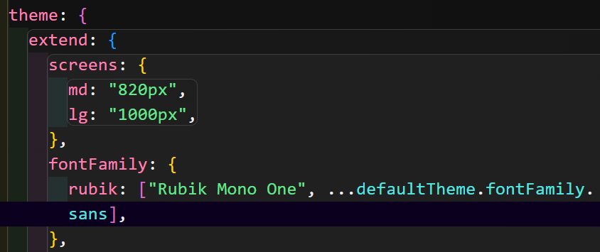
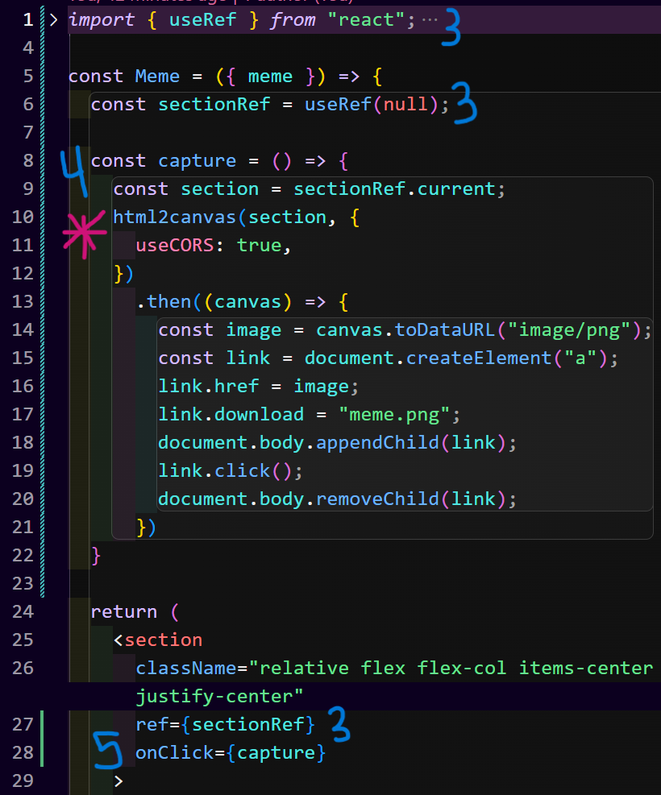

# Meme Generator

Visit the [live site](https://meme-generator-vkdn.vercel.app/) to create your own memes!

This is a *heavily-modified* project from the [Scrimba Frontend Developer Career Path](https://scrimba.com/learn/frontend) that I began long ago, but just returned to in April 2024.  

That was actually a huge benefit, as it gave me practice reading my old code to dive back in.  

There were some changes I made right off the bat, including:
- Using **React 18** rather than React 17 like in the course,
- Adding **Tailwind CSS** to speed up the styling, and
- Making it more **modular** for great **reusability**.

 

      

Built with JavaScript, React, Tailwind CSS, Vite, PNPM, and the [Memegen.link API](https://memegen.link/).

## The Project 🗒️

Meme Generator pulls popular meme images from an API and allows the user to find their fave and add top and bottom text to them.  

Here's the given project:

The learning goals were:
- Employing more **Event Listeners**
- Practicing **State**
- **Conditional Rendering**
- Working with **Forms** in React,
- And managing **side effects**

 

## My Extras 💪
1. I wanted to use **Tailwind CSS**, because, when I had began this project (maybe a year ago? 🤔) I hadn't had too much practice with it.  During *coding-phase 2*, I only had issues with the styling of the meme text.  (More about that below.)
2. I made it more **modular** by breaking out the `Input`, `Meme` and `Button` custom elements into their own components.  This also challenged me, because I had to consider the implications for **State** a lot more. 😅
3. I made one **accessibility** feature by adding the meme's returned name to the **alt text**.

4. What good is a meme generator that doesn't let you easily share them?  Sure you could screenshot it, but I found [html2canvas](https://www.npmjs.com/package/html2canvas/v/1.4.1) that will screenshot a particular DOM element for download.
5. Who downloads them?  I added the ability to copy to your clipboard.
6. Every meme has its own 'order', so obviously I needed to add **drop and drag**!

## Challenges I Faced 🚞

### Adding Google Fonts to Tailwind

I always forget how to do this!  Lots of articles exist to solve this problem, but not all of them actually work.  This is the solution I used:
- Grab the import statement from Google Fonts and paste it at the top of your tracked css file.

`@import url('https://fonts.googleapis.com/css2?family=Anton&family=Rubik+Mono+One&display=swap');`
- Paste this line at the top of your `tailwind.config`. 

`const defaultTheme = require("tailwindcss/defaultTheme");` 
- Extend the theme.

- Apply the class `font-rubik` where needed.

### Adding a Text Stoke, Also in Tailwind

I was 💯 *sure* I'd done this before, so I spent a lot of time going through my old repos and reading through all those purple links in Google.  But this time, I found this solution:

1. Install the [tailwindcss-textshadow](https://www.npmjs.com/package/tailwindcss-textshadow) package using one of the following commands:
- `npm i tailwindcss-textshadow`
- `yarn add tailwindcss-textshadow`
- `pnpm install tailwindcss-textshadow`
2. Add it as a plugin in your `tailwind.config`:

`plugins: [
  require('tailwindcss-textshadow')
]`

3. Create your custom shadow in extended themes.

`textShadow: {
    heavy:
      "2px 2px 0 #000, -2px -2px 0 #000, 2px -2px 0 #000, -2px 2px 0 #000, 0 2px 0 #000, 2px 0 0 #000, 0 -2px 0 #000, -2px 0 0 #000, 2px 2px 5px #000",
},`

4. Use your new class `text-shadow-heavy` in your markup.

### Setting Up The Screenshot Function

1. Install with `pnpm install html2canvas`.
2. Import it where you need it: `import html2canvas from "html2canvas";`
3. Set up a `ref` on the element you want to capture.
4. Define the function.
5. Set up the `onClick` where desired.

All that was *awesome*!  It captured the full section...

Except for the **meme image** - Yes, you read that right! 

It had the top and bottom text on a blank white background. 
So, close, it was just missing the meme! 🤦‍♀️

I experimented with lots of solutions, then noticed that the image url was showing in **DevTools**, so what the heck? 🤔

I remembered scanning over the docs and seeing **CORS**. 😱 Finally, I did a more thorough read and found I could simply add an option to allow that.  (You can see the solution in the code above, beside the pink asterisk on line 11.)